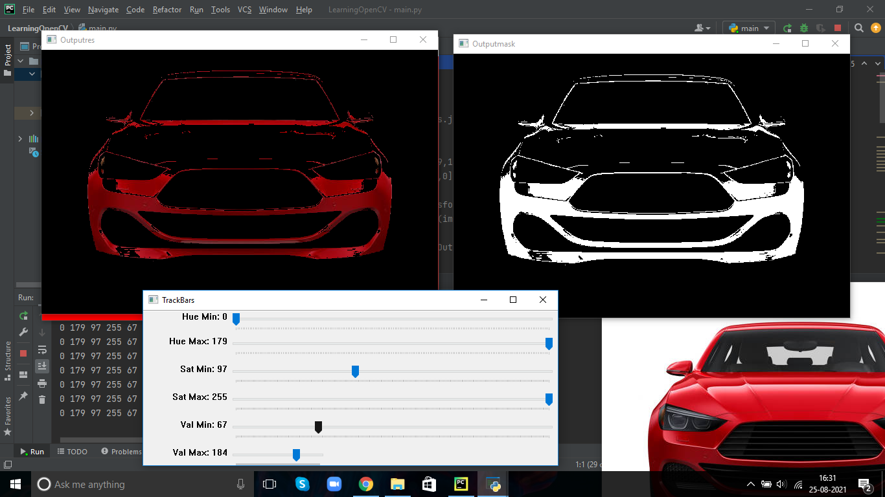

# Colour Detection using Trackbar

Trackbars provide a interesting approach towards understanding and getting the perfect values of hue, saturation and value for a certain colour while detecting out of an image. This is particularly useful while trying to pick or isolate a colour from a picture without a particular shade or even in fixing the lower and upper bound of masking arrays. This interactive tool can be used to identify the exact details based on human eye.

